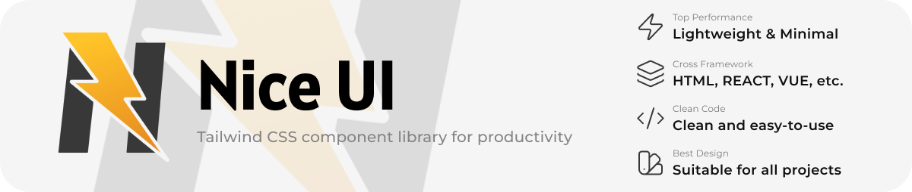

# ⚡ Nice UI — Lightweight Tailwind components that just work.

**Nice UI** is a lightweight Tailwind CSS component library built for **copy & paste productivity**.  
No complex setup. No vendor lock-in. Just **minimalist components that work in any frontend stack**.

> **Slogan:** _Nice UI — A simple Tailwind library: easy to use, fast to copy, works everywhere._

---

## ✨ Features

- 🚀 **Copy & Paste Ready** — Just grab a snippet and drop it into your project.
- 🎨 **Elegant & Minimalist Design** — Clean, modern aesthetics without fluff.
- ⚡ **Cross Framework** — Works with any stack: React, Vue, Next.js, Svelte, plain HTML, etc.
- 🌗 **Dark Mode Friendly** (optional on supported components)
- 📦 **Tailwind v4 Compatible** — Built fully with the new class syntax.

---

## 🧱 Ready-to-Use Components

### Buttons

- Primary
- Outline
- Icon Button

### Cards

- Simple Card
- Product Card (Coming Soon)

### Forms

- Input Field
- Toggle Switch

### Navigation

- Navbar (Coming Soon)
- Breadcrumb (Coming Soon)

### Feedback

- Alert
- Badge (Coming Soon)
- Modal (Coming Soon)

---

## 🤝 Contributing

```bash
# Clone repository
git clone https://github.com/yourusername/nice-ui.git

# Install dependencies
npm install

# Start development
npm run dev

```

Contribution Guidelines :

- Keep components framework-agnostic (HTML + Tailwind only)
- Follow existing naming & spacing conventions
- Include preview + code snippet for each component

---

## ❤️ Sponsors

If you love the project and want to support maintenance & new components, consider sponsoring!

Not yet accepting sponsors, but if you're interested, open an issue or DM!

---

## 📄 License

Nice UI is licensed under the MIT License — free for personal & commercial use.
